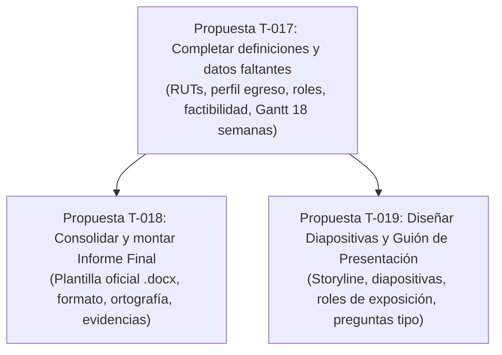

# Plan de ataque — Entrega Viernes Fase 1 Duoc

> Borrador de Matías incorporado en [[E-002 - Primera evaluación Duoc]], sus módulos y T-017 a T-023. Se conserva como antecedente; no gobierna el trabajo vigente.

## Contexto y Plazo

- **Asignatura:** PTY4614 Capstone — Fase 1.
- **Fecha límite:** Viernes 4 / Sábado 5 de septiembre de 2026.
- **Evaluación:** Presentación grupal + Informe escrito de Fase 1.
- **Puntaje total:** 100 pts (70 grupales + 30 individuales).

---

## Estructura de Tareas Propuestas

---

## Resumen de Tareas

| Tarea | Nombre | Foco principal | Puntos asociados |
|---|---|---|---|
| **Propuesta T-017** | [[Propuesta T-017 - Completar definiciones y datos faltantes del Informe]] | Resolver campos `⟨PENDIENTE⟩` del borrador (Gantt, roles, competencias, perfil). | 50 pts grupales + 10 individuales |
| **Propuesta T-018** | [[Propuesta T-018 - Consolidar y montar Informe Final Fase 1]] | Traspasar y dar formato formal en plantilla `.docx`. | 20 pts grupales (formato, plantilla, evidencias) |
| **Propuesta T-019** | [[Propuesta T-019 - Diseñar Diapositivas y Guión de Presentación]] | Diapositivas y guión de defensa para la presentación en vivo. | 20 pts individuales (exposición y trabajo en equipo) |

---

## Archivos de Trabajo Relacionados

- [[Borrador Fase 1]] (en `Documentación/Duoc/Borrador Fase 1.md`)
- [[Auditoría Fase 1]] (en `Documentación/Duoc/Auditoría Fase 1.md`)
- [[Entrega Fase 1 Duoc]] (en `Operación/Módulos/Entrega Fase 1 Duoc.md`)
