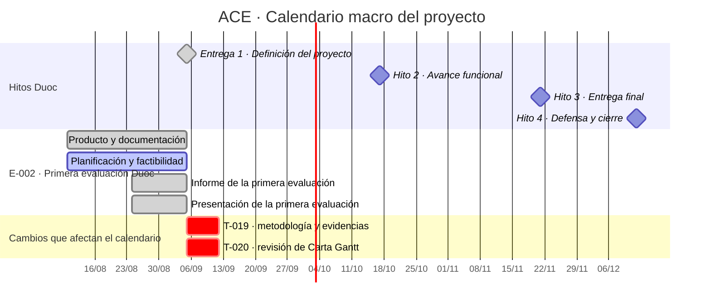

# Prototipo de calendario macro Duoc

> Vista de prueba. No es una fuente de verdad ni está conectada todavía a etapas, módulos o tareas.

## Qué busca mostrar

Una lectura macro del proyecto: los hitos académicos de Duoc organizan el tiempo; las etapas y sus módulos muestran qué tramo del proyecto está en juego. Las tareas solo aparecen cuando modifican un hito, abren trabajo nuevo relevante o cambian el orden del calendario.

## Cómo se leería

- **La franja superior** es el calendario externo: las entregas que fija Duoc.
- **Cada etapa** aparece como un bloque separado. Dentro, los módulos muestran el trabajo que construye esa etapa; no se confunden con ella.
- **Las tareas no llenan el gráfico.** Solo entran en la sección final cuando son nuevas o cuando afectan una fecha, un hito o la secuencia de trabajo.
- El estado actual se entiende sin abrir el Kanban: Entrega 1 fue enviada; planificación sigue abierta porque T-019 y T-020 requieren cierre.

## Metodología mínima propuesta

La vista se actualizaría solamente ante uno de estos eventos:

1. Duoc confirma, cambia o agrega un hito.
2. Se abre o se cierra una etapa.
3. Se abre, se cierra o se reordena un módulo de forma que afecte un hito.
4. Nace una tarea que cambia el tiempo del proyecto, bloquea un hito o exige mover prioridades.

No se actualiza por el avance ordinario de cada tarea. Para eso ya existen las tareas y el Kanban.

## Datos que usaría después de conectarse

| Dato actual | Uso en la vista |
|---|---|
| Etapa | Sección principal del calendario. |
| Módulo | Barra dentro de su etapa. |
| `fecha_limite` | Fecha de hito o marcador de una tarea relevante. |
| Estado | Color/estado visual del bloque. |
| Dependencias | Señal de bloqueo o riesgo cuando afecten un hito. |

Una tarea solo necesitaría `inicio` si fuera necesario dibujar su duración. Si no, se muestra como marcador de fecha y no se inventa una barra.

## Límites deliberados

- No reemplaza el Kanban ni duplica tareas.
- No convierte cada actividad pequeña en una barra.
- No modifica la Entrega 1 ni su Excel académico.
- Las fechas y duraciones de este prototipo son ilustrativas; se validan recién al conectar la vista al sistema real.
