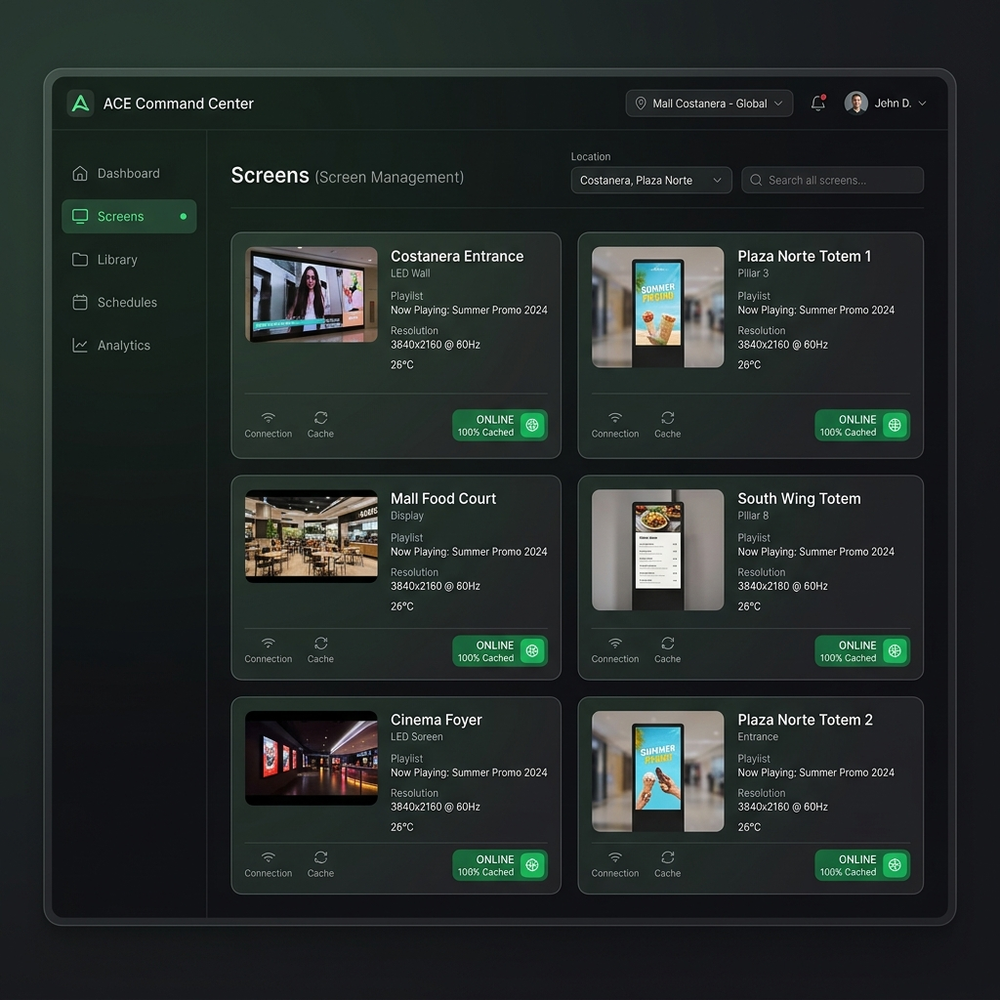
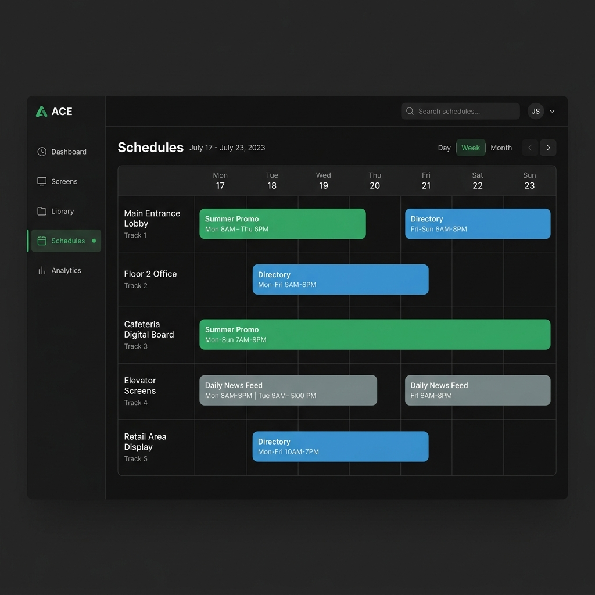
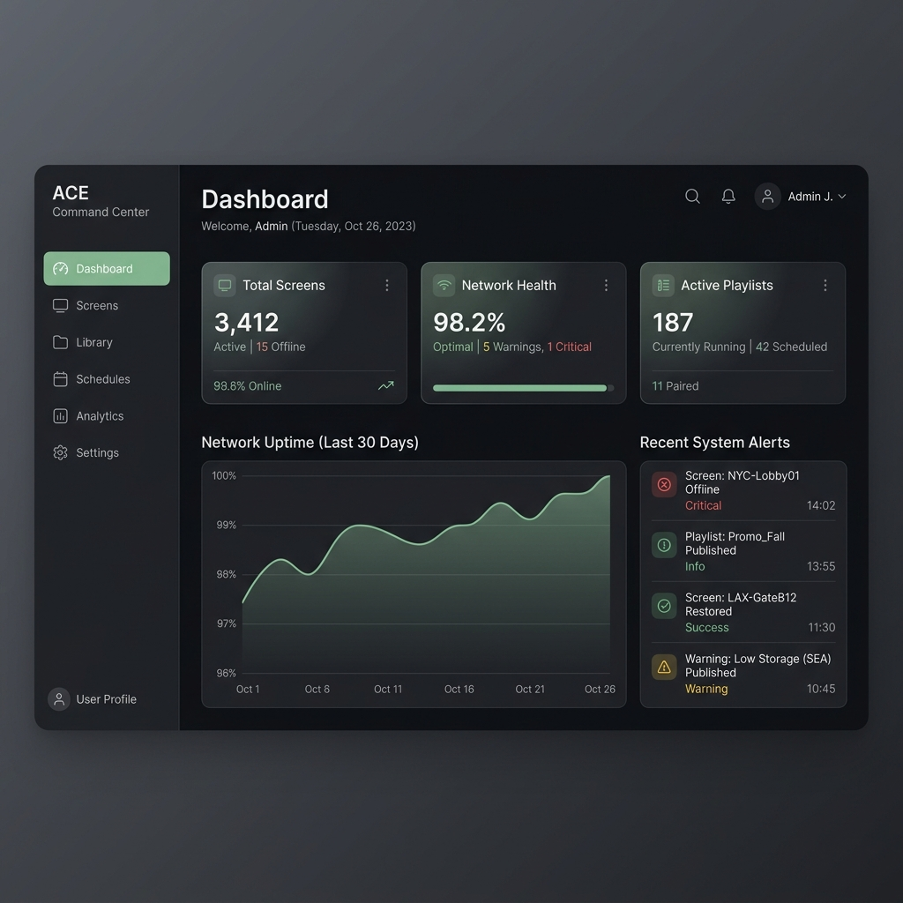
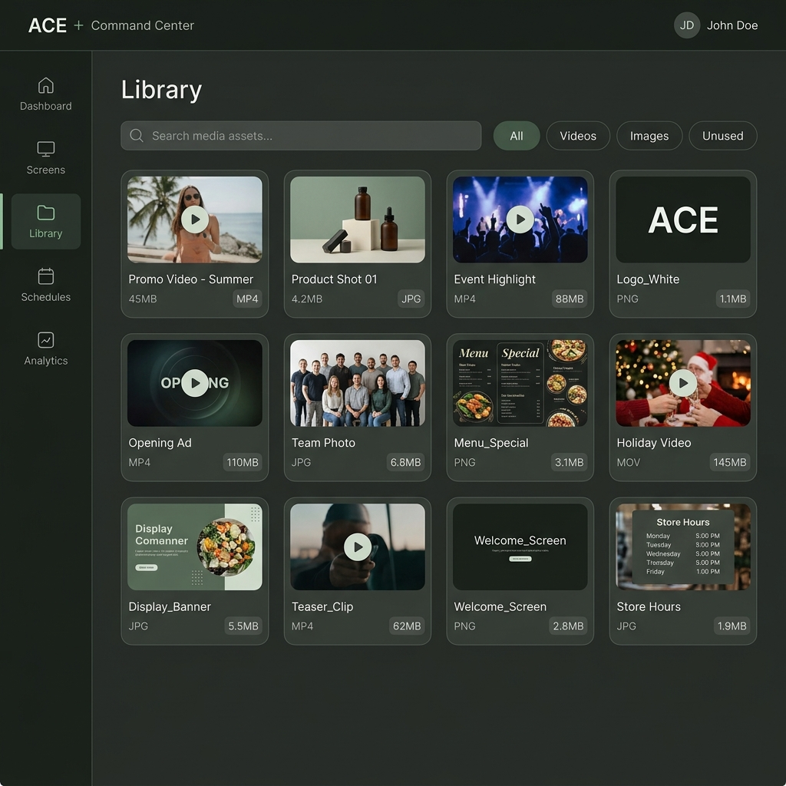

# ACE Command Center - Mockups Minimalistas

A partir de la vista original que compartiste, he diseñado vistas completas siguiendo una línea **ultra minimalista** y manteniendo la identidad visual oscura (dark mode) con acentos verdes tenues y grises.

Aquí tienes las propuestas para **Screens (Gestión de Pantallas)** y **Schedules**, sumadas a las anteriores. Navega entre ellas usando el carrusel a continuación:

````carousel
### Vista: Screens (Gestión de Pantallas)
Inspirada en tu captura original pero rediseñada para ser extremadamente limpia. Las tarjetas muestran el contenido en vivo, datos técnicos vitales (resolución, temperatura) y el estado de la red (conectividad/caché).



<!-- slide -->

### Vista: Schedules (Programación)
Una línea de tiempo intuitiva para asignar listas de reproducción a pantallas específicas. Los bloques de colores tenues representan el contenido programado, permitiendo ver rápidamente la distribución semanal sin saturación visual.



<!-- slide -->

### Vista: Dashboard
Un resumen de alto nivel del estado de la red. Prioriza métricas clave y un gráfico limpio de tiempo de actividad.



<!-- slide -->

### Vista: Library (Gestor de Medios)
Una cuadrícula de recursos multimedia altamente organizada con filtros rápidos y tarjetas que muestran únicamente la información esencial.


````

**Conceptos clave aplicados al diseño:**
1. **Espaciado generoso:** Eliminación de bordes duros y uso extensivo del espacio negativo para que la interfaz "respire".
2. **Tipografía moderna:** Fuentes sin serifa limpias y jerarquía visual clara para guiar la lectura de los datos.
3. **Reducción de ruido:** Uso sutil de *glassmorphism* (efecto cristal) en elementos secundarios y colores apagados para el fondo, dejando que el contenido clave resalte de forma natural.
