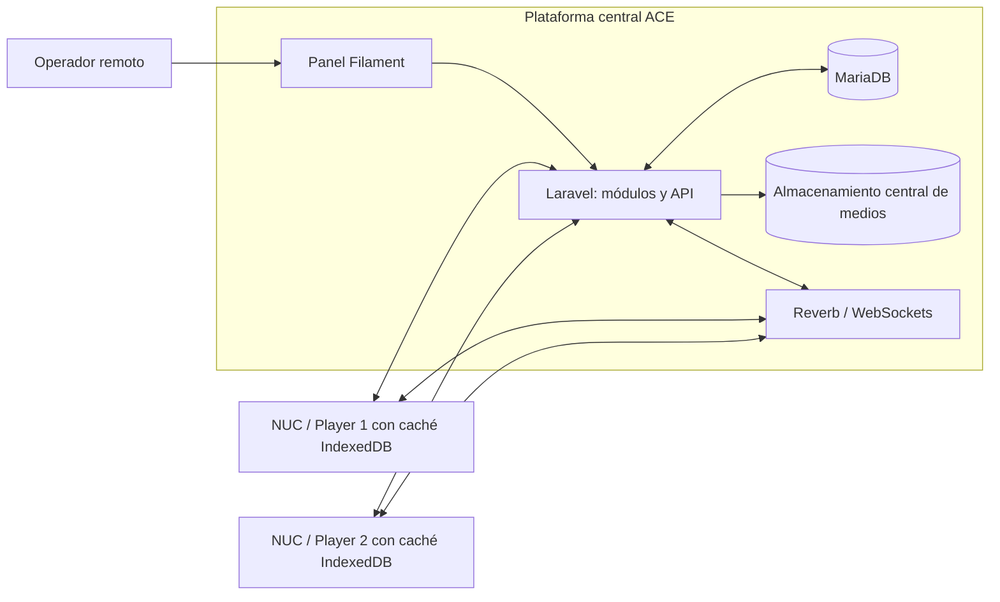

# Arquitectura

## Decisiones vigentes

- Backend como monolito modular en Laravel.
- MariaDB como base de datos central.
- Filament v5 para el panel administrativo.
- Laravel Reverb y WebSockets para tiempo real.
- Sesiones Laravel/Filament para humanos y tokens revocables de Sanctum para los NUC.
- Cada Player mantiene en caché IndexedDB los medios y la programación que le corresponden; reproduce siempre desde esa caché.
- La API se expondrá mediante HTTPS y Reverb mediante WSS en despliegues remotos.

## Topología principal

La infraestructura concreta de despliegue queda pendiente, pero la plataforma central debe ser accesible remotamente.

## Flujos

1. El operador administra locaciones, pantallas, medios, playlists y programación desde el panel Filament.
2. Los NUC autentican contra la API, reciben cambios y descargan por anticipado los medios y la programación que les corresponden.
3. Antes de marcar un medio como disponible, el Player verifica su checksum y lo guarda con la programación en IndexedDB.
4. La reproducción se realiza desde la caché local. Una caída de internet obliga a continuar con los recursos programados localmente, sin depender del servidor central.
5. Al recuperar conectividad, el NUC informa su estado y resincroniza mediante API y Reverb.

## Operación local sin internet

ACE permitirá cambiar contenido y programación desde la locación, usando los recursos disponibles localmente. Durante un corte no se puede descargar contenido del servidor central. La topología sigue abierta:

- Panel individual por NUC.
- PC con panel único conectado por red local a varios NUC.

La decisión depende de validar la realidad operativa con el equipo y Lumina Motion. Ver [[Gestión local sin internet]].

Independiente de esa decisión, el flujo local no reemplaza la plataforma central: es un respaldo para operar sobre los NUC de la locación cuando no existe conectividad remota.

## Alcance técnico inicial

- Telemetría básica: conectado o desconectado, última comunicación y estado de sincronización.
- Formatos: MP4 H.264, JPG, PNG y GIF.
- Programaciones por fecha, horario y recurrencia semanal; no se permiten solapamientos efectivos.
- Las programaciones se pueden editar, cancelar o interrumpir; el estado resultante debe ser válido.
- Reproducción autónoma basada en recursos sincronizados antes del corte; no hay streaming desde la plataforma central.

## Pendiente

- Plataforma concreta del Player: PWA/kiosco, Electron u otra alternativa.
- Modalidad exacta de operación local por LAN.
- Proveedor de hosting, almacenamiento central y despliegue.
- Validación de cuota y persistencia de IndexedDB con contenido real en NUC.
