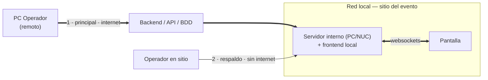

# Arquitectura

Refleja el diagrama. Componentes tentativos, decisiones sin cerrar.

## Topología

## Flujos

1. **Principal.** El operador remoto trabaja contra el backend por internet.
2. **Respaldo.** Si cae internet, la operación no puede depender del servidor
   remoto: el PC conectado a la pantalla expone su propio frontend y se opera
   en sitio.

Dónde corre el backend — nube, servidor interno, o ambos — está abierto.

## Componentes

| Componente | Estado |
|---|---|
| Pantalla | dibujado |
| Servidor interno (PC / NUC) | dibujado |
| PC Operador remoto | dibujado |
| Backend / API / BDD | dibujado, ubicación abierta |
| WebSockets | dibujado, funcionamiento abierto |
| Frontend local en el servidor interno | confirmado — respaldo sin internet |
| Electron en pantalla | opción sin evaluar |

## Abierto

| Caja | Nota |
|---|---|
| Modelo de datos | documentado en [[Modelo de datos]] |
| Base de datos — motor y topología | pendiente de definir |
| Lenguaje y framework backend | pendiente de definir |
| Diseño de la API REST | pendiente de definir |
| Diseño front-end | pendiente de definir |
| Mockups | pendiente de definir |
| Infraestructura y hosting | pendiente de definir |
| Reproducción en pantalla | pendiente de definir |
