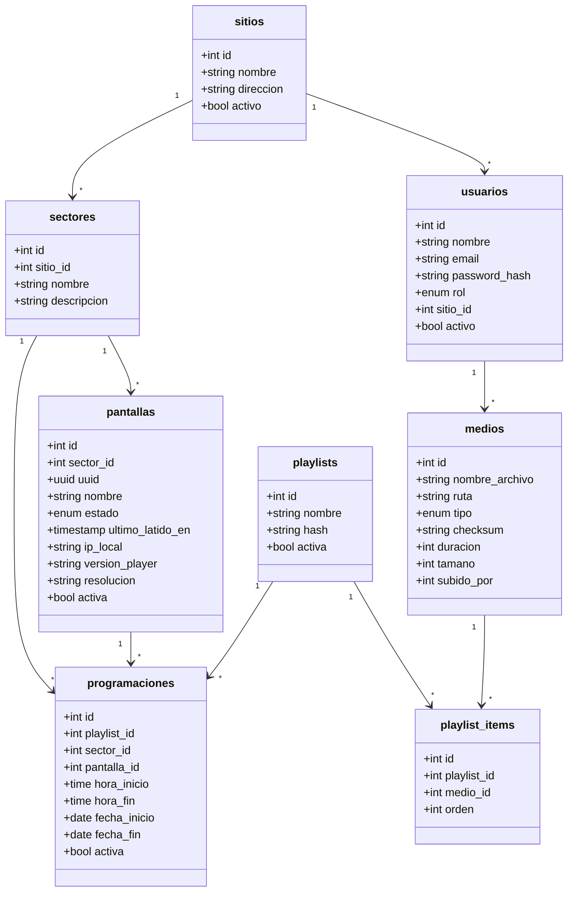

# Modelo de datos

## Entidades

| Entidad | Qué es |
|---|---|
| `sitios` | Instalación fija. Equivale al cliente de Lumina. |
| `sectores` | Subdivisión del sitio: Lobby, Zona VIP. |
| `pantallas` | Dispositivo físico. Pertenece a un sector. |
| `medios` | Archivo único, con checksum. |
| `playlists` | Lista ordenada de contenido. |
| `playlist_items` | Un medio dentro de una playlist, con su orden. |
| `programaciones` | Qué playlist se emite, dónde y en qué ventana horaria. |
| `usuarios` | Acceso a nivel de sitio. |

## Campos que merecen explicación

- `pantallas.uuid` — identificador usado en la API. Evita exponer el `id`
  incremental y que se puedan adivinar otras pantallas. Viene del legacy.
- `playlists.hash` — cambia cada vez que se edita la lista. La pantalla lo
  compara y sabe si hay novedades sin descargar el contenido completo.
  Viene del legacy.
- `medios.checksum` — SHA-256 del archivo. La pantalla no vuelve a descargar
  lo que ya tiene. Viene del legacy.
- `programaciones.sector_id` y `pantalla_id` — se usa uno u otro. Si ambos
  van vacíos, la programación es global.
- `usuarios.sitio_id` — vacío en el administrador, que ve todos los sitios.

## Decidido

- **No existe entidad evento.** Las pantallas quedan instaladas de forma fija.
  El horario cuelga del contenido, no de una jornada.
- **Jerarquía de dos niveles:** sitio → sector → pantalla.
- **Cliente = sitio.** Un cliente no tiene más de un sitio por ahora.
- **Permisos a nivel de sitio.** El sector dirige contenido, no controla acceso.
- **Dos roles:** administrador (todos los sitios) y operador (su sitio).
- **El archivo se separa de su uso.** Un medio se reusa en varias playlists sin
  volver a subirlo.
- **La playlist no lleva horario ni destino.** Eso vive en `programaciones`.

## Convenciones

- Tablas en plural y `snake_case`.
- Nombres en español.
- Las claves foráneas terminan en `_id`.
- Los campos de fecha y hora de un evento terminan en `_en`.

## Descartado del legacy

- `groups` plano: colapsaba sitio y sector en una sola tabla.
- `media_items.playlist_id`: ataba cada archivo a una única playlist.
- Horario y destino dentro de `playlists`: tres responsabilidades en una tabla.
- `screens.zone` como texto libre: lo reemplaza `sectores`.

## Abierto

- ¿Se puede sobrescribir la duración de una imagen dentro de una playlist, o
  la duración es siempre la del medio?
- ¿Qué pasa si dos programaciones se superponen en la misma pantalla? Hace
  falta una regla: prioridad, o prohibir el solapamiento.
- ¿Las programaciones se repiten por día de la semana, o solo por rango de
  fechas?
- Permisos por sector (Cristóbal lo ve improbable).

NOTAS EQUIPO 

-Relacion sitios usuarios- un usuario deberia poder tener varioas sitios
-un medio tiene un nduracion, pero no necesariamente , podria ser ffoto, gif , etc; el medio tienen  qu ete ner un duracion dentro de la reproduccion y hay que fijar de en qu etabla vive eso(programacion,playlist,playlistitem)