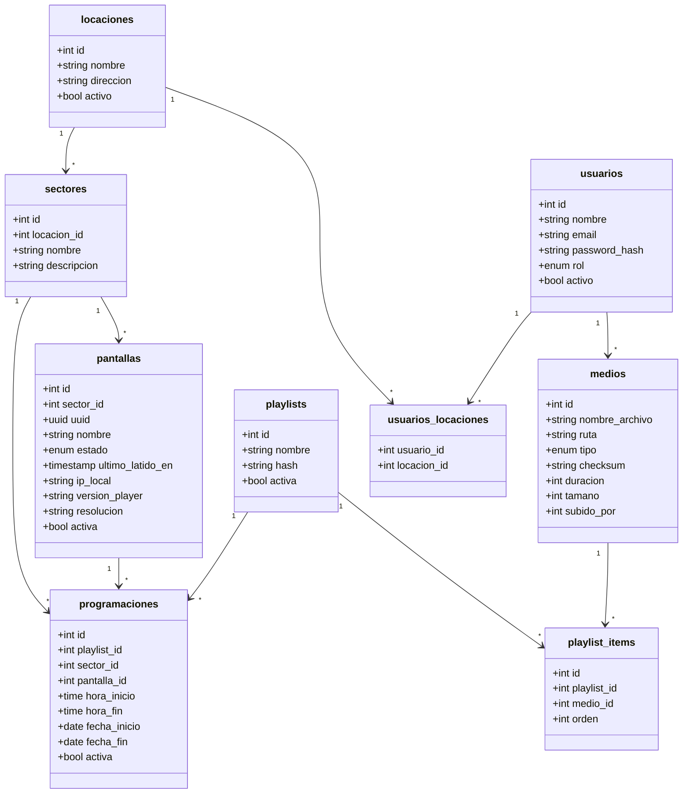

# Modelo de datos

El modelo completo sigue en propuesta. La base de locaciones y accesos se acordó con Tomás el 2026-09-03: sin entidad cliente por ahora, uso inicial por Cristóbal como administrador y operadores previstos para una o varias locaciones. El alcance de contenido y playlists todavía requiere definición.

## Entidades

| Entidad | Qué es |
|---|---|
| `locaciones` | Instalación fija. No representa una entidad cliente. |
| `sectores` | Subdivisión de la locación: Lobby, Zona VIP. |
| `pantallas` | Dispositivo físico. Pertenece a un sector. |
| `medios` | Archivo único, con checksum. |
| `playlists` | Lista ordenada de contenido. |
| `playlist_items` | Un medio dentro de una playlist, con su orden. |
| `programaciones` | Qué playlist se emite, dónde y en qué ventana horaria. |
| `usuarios` | Identidad y rol: administrador u operador. |
| `usuarios_locaciones` | Asignaciones de acceso de operadores a locaciones. |

## Campos que merecen explicación

- `pantallas.uuid` — identificador usado en la API. Evita exponer el `id`
  incremental y que se puedan adivinar otras pantallas. Viene del legacy.
- `playlists.hash` — cambia cada vez que se edita la lista. La pantalla lo
  compara y sabe si hay novedades sin descargar el contenido completo.
  Viene del legacy.
- `medios.checksum` — SHA-256 del archivo. La pantalla no vuelve a descargar
  lo que ya tiene. Viene del legacy.
- `programaciones.sector_id` y `pantalla_id` — se usa uno u otro. Si ambos
  van vacíos, la propuesta anterior la considera global; ese alcance queda pendiente de delimitar antes de habilitar operadores.
- `usuarios.rol` — valores `administrador` y `operador`. El rol determina las capacidades; las asignaciones determinan las locaciones accesibles al operador.
- `usuarios_locaciones` — clave primaria compuesta (`usuario_id`, `locacion_id`); ambas columnas son claves foráneas. No se repite la pareja ni se limita una locación a un solo operador.
- El administrador accede a todas las locaciones por su rol, sin requerir filas en `usuarios_locaciones`. Un operador sin asignaciones no tiene acceso a ninguna; una lista vacía nunca concede acceso global.

## Base adoptada: locaciones y acceso

- **Sin entidad cliente por ahora.** La realidad actual descrita por Tomás no justifica esa agrupación adicional. Esto no afirma que cliente y locación sean el mismo concepto.
- **Primer uso:** Cristóbal como administrador. No se requieren cuentas de operador para iniciar, pero el modelo ya permite incorporarlas después.
- **Operadores:** una o varias locaciones autorizadas por usuario. No se impone un único operador por locación.
- **Sin SaaS comercial:** no se incorporan planes, suscripciones ni personalización por cliente.
- **Validación pendiente con Cristóbal y el equipo:** confirmar la realidad actual y qué cambios futuros justificarían revisar esta base. No se registra como aprobación del cliente.

Respuesta y contexto: [[Operadores, clientes y locaciones]].

## Decidido

- **No existe entidad evento.** Las pantallas quedan instaladas de forma fija.
  El horario cuelga del contenido, no de una jornada.
- **Jerarquía:** locación → sector → pantalla.
- **Permisos a nivel de locación.** El sector dirige contenido, no controla acceso.
- **Dos roles:** administrador (todas las locaciones) y operador (locaciones asignadas).
- **El archivo se separa de su uso.** Un medio se reusa en varias playlists sin
  volver a subirlo.
- **La playlist no lleva horario ni destino.** Eso vive en `programaciones`.

## Convenciones

- Tablas en plural y `snake_case`.
- Nombres en español.
- Las claves foráneas terminan en `_id`.
- Los campos de fecha y hora de un evento terminan en `_en`.

## Descartado del legacy

- `groups` plano: colapsaba locación y sector en una sola tabla.
- `media_items.playlist_id`: ataba cada archivo a una única playlist.
- Horario y destino dentro de `playlists`: tres responsabilidades en una tabla.
- `screens.zone` como texto libre: lo reemplaza `sectores`.

## Abierto

- **Segmentación de medios y playlists por locación/es:** es necesaria, pero su relación exacta y reglas de compartición todavía no están acordadas. Las tablas del diagrama no completan aún ese aislamiento; `subido_por` identifica al autor, no concede acceso ni define el alcance.
- **Programación global:** definir su alcance y autorización de forma consistente con las locaciones permitidas. No habilitar operadores usando una interpretación global irrestricta.
- ¿Se puede sobrescribir la duración de una imagen dentro de una playlist, o
  la duración es siempre la del medio?
- ¿Qué pasa si dos programaciones se superponen en la misma pantalla? Hace
  falta una regla: prioridad, o prohibir el solapamiento.
- ¿Las programaciones se repiten por día de la semana, o solo por rango de
  fechas?
- Permisos por sector (Cristóbal lo ve improbable).

NOTAS EQUIPO 

- Relación usuarios/locaciones atendida el 2026-09-03 mediante `usuarios_locaciones`; permite varias locaciones por usuario.
-un medio tiene un nduracion, pero no necesariamente , podria ser ffoto, gif , etc; el medio tienen  qu ete ner un duracion dentro de la reproduccion y hay que fijar de en qu etabla vive eso(programacion,playlist,playlistitem)
