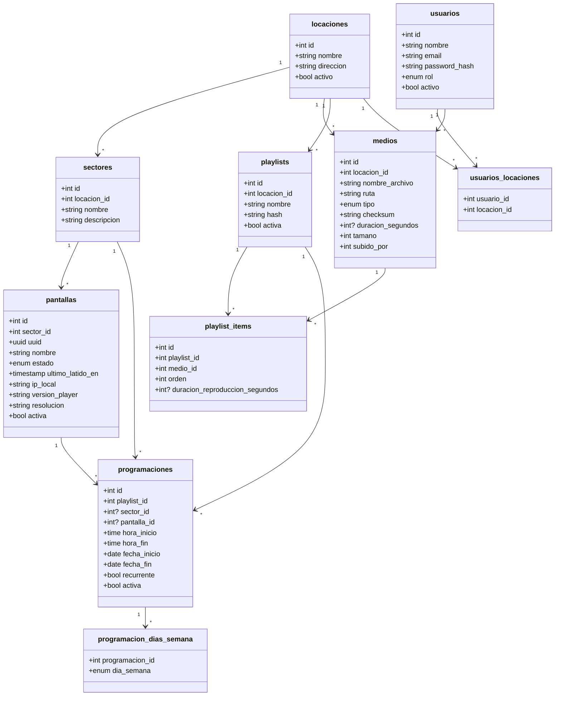

# Modelo de datos

El modelo completo sigue en propuesta. La base de locaciones, accesos, bibliotecas y recurrencia mínima se acordó con Tomás entre el 2026-09-03 y el 2026-09-04: sin entidad cliente por ahora, uso inicial por Cristóbal como administrador, operadores previstos para una o varias locaciones, contenido aislado por locación y recurrencia por días de semana seleccionados. Los solapamientos y el comportamiento de duración por tipo de medio todavía requieren definición.

## Entidades

| Entidad | Qué es |
|---|---|
| `locaciones` | Instalación fija. No representa una entidad cliente. |
| `sectores` | Subdivisión de la locación: Lobby, Zona VIP. |
| `pantallas` | Dispositivo físico. Pertenece a un sector. |
| `medios` | Archivo único, con checksum, de una locación. |
| `playlists` | Lista ordenada de contenido de una locación. |
| `playlist_items` | Una aparición de un medio dentro de una playlist, con su orden y tiempo de exhibición. |
| `programaciones` | Qué playlist se emite, dónde, cuándo y si se repite. |
| `programacion_dias_semana` | Días elegidos para una programación recurrente. |
| `usuarios` | Identidad y rol: administrador u operador. |
| `usuarios_locaciones` | Asignaciones de acceso de operadores a locaciones. |

## Campos que merecen explicación

- `pantallas.uuid` — identificador usado en la API. Evita exponer el `id`
  incremental y que se puedan adivinar otras pantallas. Viene del legacy.
- `playlists.hash` — cambia cada vez que se edita la lista. La pantalla lo
  compara y sabe si hay novedades sin descargar el contenido completo.
  Viene del legacy.
- `medios.checksum` — SHA-256 del archivo. La pantalla no vuelve a descargar
  lo que ya tiene. Viene del legacy.
- `medios.duracion_segundos` — duración propia del archivo, expresada en segundos y nula cuando el medio no tiene una duración propia aplicable. No determina cuánto debe mostrarse en una playlist.
- `playlist_items.duracion_reproduccion_segundos` — tiempo de exhibición configurado, en segundos, para esa aparición. Por ahora se utiliza solo cuando el medio no tiene duración propia. El atributo no define todavía si un medio con duración propia debe cortarse, repetirse o reproducirse completo.
- `medios.tipo` — describe el medio; el ítem lo consulta mediante `medio_id`, sin duplicarlo en `playlist_items`.
- `programaciones.sector_id` y `pantalla_id` — debe existir exactamente uno: una programación se dirige a un sector o a una pantalla, nunca a ambos ni queda sin destino. La locación se obtiene desde ese destino y no se duplica en `programaciones`.
- `programaciones.recurrente` — si es falso, `fecha_inicio`, `fecha_fin`, `hora_inicio` y `hora_fin` describen una única programación. Si es verdadero, las fechas delimitan su vigencia y las horas la franja aplicable en los días seleccionados.
- `programacion_dias_semana` — usa clave primaria compuesta (`programacion_id`, `dia_semana`). Solo tiene filas cuando `recurrente` es verdadero y contiene uno o más días entre lunes y domingo. Sus siete días equivalen a una programación diaria.
- `usuarios.rol` — valores `administrador` y `operador`. El rol determina las capacidades; las asignaciones determinan las locaciones accesibles al operador.
- `usuarios_locaciones` — clave primaria compuesta (`usuario_id`, `locacion_id`); ambas columnas son claves foráneas. No se repite la pareja ni se limita una locación a un solo operador.
- El administrador accede a todas las locaciones por su rol, sin requerir filas en `usuarios_locaciones`. Un operador sin asignaciones no tiene acceso a ninguna; una lista vacía nunca concede acceso global.

## Base adoptada: locaciones y acceso

- **Sin entidad cliente por ahora.** La realidad actual descrita por Tomás no justifica esa agrupación adicional. Esto no afirma que cliente y locación sean el mismo concepto.
- **Primer uso:** Cristóbal como administrador. No se requieren cuentas de operador para iniciar, pero el modelo ya permite incorporarlas después.
- **Operadores:** una o varias locaciones autorizadas por usuario. No se impone un único operador por locación.
- **Bibliotecas:** cada locación mantiene sus propios medios y playlists; no se comparten entre locaciones por ahora.
- **Sin SaaS comercial:** no se incorporan planes, suscripciones ni personalización por cliente.
- **Validación pendiente con Cristóbal y el equipo:** confirmar la realidad actual y qué cambios futuros justificarían revisar esta base. No se registra como aprobación del cliente.

Respuesta y contexto: [[Operadores, clientes y locaciones]].

## Decidido

- **No existe entidad evento.** Las pantallas quedan instaladas de forma fija.
  El horario cuelga del contenido, no de una jornada.
- **Jerarquía:** locación → sector → pantalla.
- **Permisos a nivel de locación.** El sector dirige contenido, no controla acceso.
- **Dos roles:** administrador (todas las locaciones) y operador (locaciones asignadas).
- **Bibliotecas aisladas:** `medios` y `playlists` pertenecen a una locación. Una playlist solo incluye medios de su locación y solo se programa en destinos de esa misma locación.
- **El archivo se separa de su uso.** Un medio se reusa en varias playlists sin
  volver a subirlo dentro de su biblioteca de locación.
- **Dos duraciones distintas, acordadas con Tomás el 2026-09-03:** la propia del archivo, nullable y en segundos, en `medios.duracion_segundos`; y el tiempo de exhibición, nullable y en segundos, en `playlist_items.duracion_reproduccion_segundos` cuando el medio no tiene duración propia.
- **La playlist no lleva horario ni destino.** Eso vive en `programaciones`.
- **Programación localizada:** se dirige exactamente a un sector o una pantalla; su locación es la del destino y debe coincidir con la de su playlist.
- **Recurrencia mínima:** una programación es única o recurrente. La recurrente se aplica en los días de semana elegidos dentro de su rango de vigencia; no se incorporan intervalos genéricos, mensualidades, feriados ni excepciones todavía.

## Convenciones

- Tablas en plural y `snake_case`.
- Nombres en español.
- Las claves foráneas terminan en `_id`.

## Descartado del legacy

- `groups` plano: colapsaba locación y sector en una sola tabla.
- `media_items.playlist_id`: ataba cada archivo a una única playlist.
- Horario y destino dentro de `playlists`: tres responsabilidades en una tabla.
- `screens.zone` como texto libre: lo reemplaza `sectores`.

## Abierto

- **Comportamiento de duración por tipo de medio:** quedaron decididas las unidades (segundos) y la nulabilidad. Falta definir corte, repetición o reproducción completa para videos, GIFs y otros medios con duración propia. Casos para conversar en [[Preguntas agrupadas]].
- ¿Qué pasa si dos programaciones se superponen en la misma pantalla? Hace
  falta una regla: prioridad, o prohibir el solapamiento.
- ¿Se permiten franjas horarias que cruzan medianoche, o deben dividirse en dos programaciones?
- Permisos por sector no forman parte del alcance inicial; el acceso llega hasta la locación.

NOTAS EQUIPO 

- Relación usuarios/locaciones atendida el 2026-09-03 mediante `usuarios_locaciones`; permite varias locaciones por usuario.
- Ubicación de la duración de reproducción atendida el 2026-09-03 en `playlist_items`; el comportamiento por tipo de medio permanece abierto.
