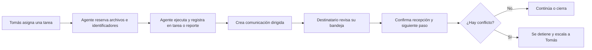

# Comunicación entre agentes ACE

La tarea guarda el trabajo. La comunicación solo avisa qué cambió y quién debe actuar.

## Bandeja

Cada aviso es una nota en `Operación/Comunicaciones/` con destinatario y estado.

Al comenzar una sesión, cada agente revisa las comunicaciones dirigidas a su identidad que no estén `cerradas`. Esta revisión es la señal v0: no depende de que el agente encuentre un aviso dentro de otra nota.

Estados:

1. `pendiente`: el destinatario todavía no confirmó lectura.
2. `recibida`: leyó el aviso y registró el siguiente paso.
3. `cerrada`: la acción o decisión asociada terminó.

## Flujo mínimo

## Antes de trabajar

El ejecutor registra en la tarea:

- `ejecutado_por`.
- Archivos que modificará.
- Identificadores que usará.

Un archivo o identificador reservado no se usa en paralelo. Si ya está reservado, el segundo agente se detiene y comunica el conflicto.

## Entrega

El resultado vive en la tarea, el reporte o el documento correspondiente. La comunicación enlaza esos artefactos y declara una sola acción esperada:

- revisar;
- continuar;
- decidir;
- solo informar.

El destinatario cambia el estado a `recibida` y escribe el siguiente paso. Si otra persona debe continuar, se crea una nueva comunicación dirigida; no se reutiliza un aviso anterior.

## Conflictos y escalamiento

Se escala a Tomás cuando:

- dos agentes necesitan editar el mismo archivo;
- existe desacuerdo sobre una decisión;
- una instrucción nueva contradice un acuerdo registrado;
- no está claro quién debe continuar.

Mientras el conflicto siga abierto, nadie modifica los archivos involucrados.

## Fuente de verdad

- La tarea define asignación, alcance y reservas.
- El reporte explica resultado e implicancias.
- La comunicación señala destinatario, acción y recepción.
- Tomás resuelve conflictos y adopta decisiones.

## Límite de v0

No hay notificación automática. La garantía depende de revisar la bandeja al comenzar cada sesión. Automatizar la señal queda fuera de esta versión.
