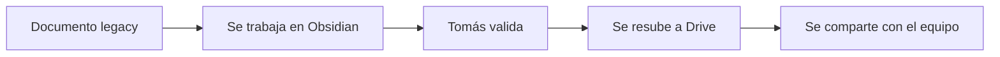

# Destino del legacy

Propuesta. **Nada se movió, borró ni resubió.** Requiere aprobación de Tomás
antes de ejecutarse.

## Propuesta por documento

| Documento | Destino | Motivo |
|---|---|---|
| Acta de Constitución | **Actualizar** | Entiende el producto. Hay que corregir los hitos declarados como completados e incorporar la jerarquía de sitios, los usuarios y los dos flujos de operación. |
| Documento de Visión | **Reemplazar** | Su contenido pasa a `Producto.md`. El original se archiva. |
| Matriz de Casos de Uso | **Actualizar** | CU-01 a CU-05 siguen válidos. CU-06 cambia con la nueva jerarquía. Faltan los casos de operación en sitio. |
| Diccionario de Datos | **Archivar** | Reemplazado por `Decisiones/Modelo de datos`. Sus convenciones ya quedaron rescatadas. |
| Especificación Técnica de la API | **Archivar** | La caja de API sigue abierta. El patrón de respuesta ya quedó registrado en la clasificación. |
| Guía de Comandos y Terminal | **Descartar** | Material de aprendizaje de Laravel. No define el producto. |
| A.C.E Notas Tomás | **Archivar, con extracción previa** | Contiene información que no está en ningún otro lado. Ver abajo. |

## Extraer antes de archivar

La copia en Drive de `A.C.E Notas Tomás` tiene contexto de cliente que no está
registrado en otro documento:

- Software que Lumina usa hoy: **Unreal Engine y Unity**.
- La cadena física es **pantallas → servidor → computador**.
- Se mencionan **paneles LED**, no solo pantallas.
- Seis preguntas abiertas para Cristóbal, tres de ellas no registradas en
  ninguna otra parte: si las pantallas son IOT o solo reproductores, si
  funcionan como módulos, y si se usan paneles LED.

Esas preguntas alimentan directamente las cajas **Reproducción en pantalla** e
**Infraestructura**, que hoy no tienen nada aprovechable.

## Flujo propuesto

Ningún documento se toca en Drive hasta que su versión actualizada esté
validada.

## Sobre archivar

Propuesta: crear una carpeta `Archivo` dentro de `Proyecto ACE` en Drive y
mover ahí lo que se archive y lo que se descarte.

**Nada se borra.** "Descartar" significa que deja de considerarse material del
proyecto, no que desaparezca.

## Enlaces

- [[Clasificación del legacy]]
- [[Producto]]
