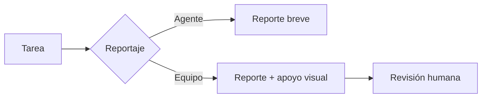

# Sistema inicial de reportaje

## Qué pasó

Se separaron tareas, documentación, decisiones y reportes. Cada tarea puede requerir reportaje **ninguno**, **agente** o **equipo**.

## Por qué

Los checks muestran ejecución, pero no conservan una historia comprensible del proyecto.

## Implicancias

- Los reportes no duplican contenido.
- El reportaje de equipo requiere revisión humana y apoyo visual.
- Varias tareas pueden consolidarse en un reporte de iniciativa.

## Estado actual

Propuesta implementada como piloto en Obsidian. Pendiente de revisión de Tomás.

## Enlaces

- [[Sistema de reportaje ACE]]
- [[Operación y reportaje de ACE]]
- [[T-001 - Definir niveles de reportaje]]

## Apoyo visual

