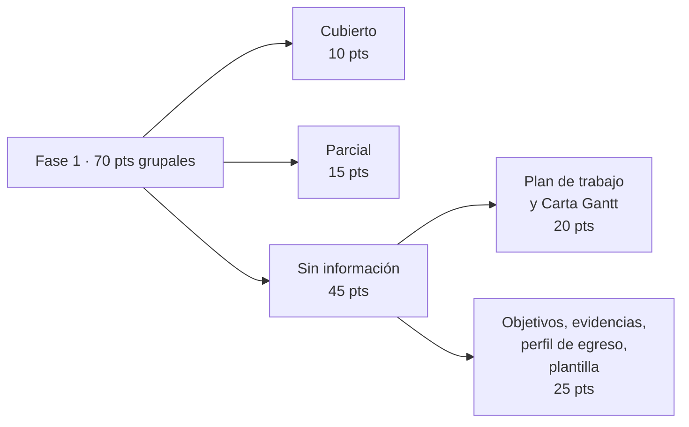

# Auditoría Fase 1 Duoc

## Qué pasó

Se revisaron la guía del estudiante, el cronograma, la planilla de evaluación,
la formativa y los documentos existentes en Drive y en local. El resultado es
una lista de exigencias con su estado.

## Por qué

La presentación grupal es la única evaluación sumativa de la Fase 1 y ocurre
esta semana. No existía un inventario de qué exige la asignatura ni de qué
falta.

## Implicancias

- **No hay ningún entregable de Fase 1 iniciado.** Drive y local solo contienen
  las plantillas del docente en blanco.
- **Falta un documento.** El cronograma nombra `1.5_APT122_SumativaFase1.docx`
  y ese archivo no está en ninguna de las dos ubicaciones.
- **Veinte de los setenta puntos grupales** dependen del plan de trabajo y la
  Carta Gantt, que no existen.
- **Ocho vacíos requieren respuesta del equipo.** Ninguno se puede completar
  por suposición: carrera, sede y RUT, competencias del perfil de egreso,
  objetivos, metodología, evidencias acordadas con el docente, intereses
  profesionales de cada integrante, y recursos materiales.

## Estado actual

Auditoría terminada. Pendiente de revisión de Tomás. T-009 puede avanzar solo
sobre los indicadores que ya tienen información confirmada.

## Enlaces

- [[Auditoría Fase 1]]
- [[T-008 - Auditar entregables Fase 1 Duoc]]
- [[T-009 - Preparar borradores Fase 1 Duoc]]

## Apoyo visual

