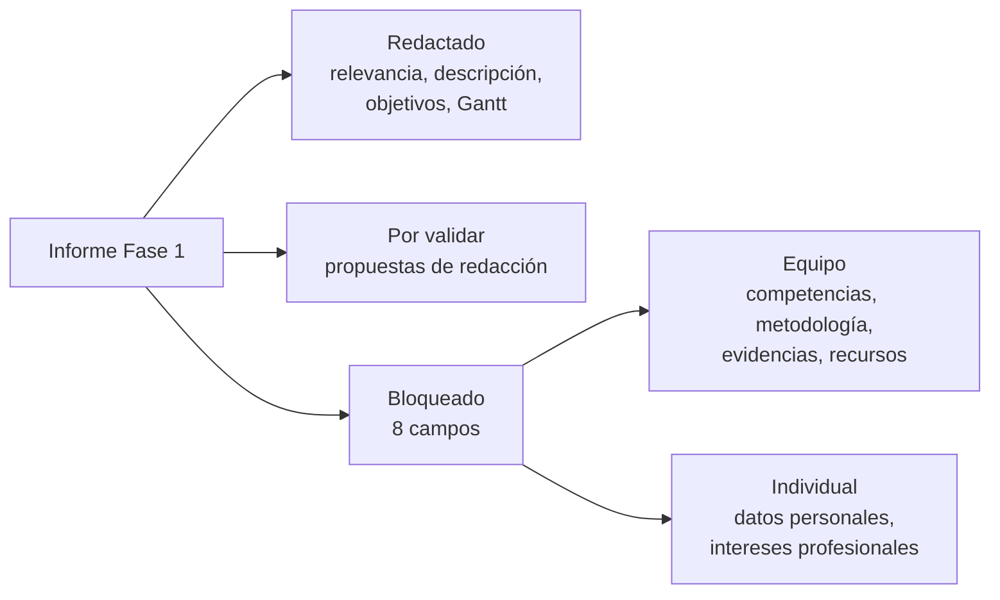

# Borradores Fase 1 Duoc

## Qué pasó

Se redactó el borrador del informe de Fase 1 siguiendo la estructura de la guía
del estudiante. Los campos quedaron en tres estados: redactados, marcados como
**⟨PROPUESTA⟩** para validación, o marcados como **⟨PENDIENTE⟩** cuando
requieren respuesta del equipo.

## Por qué

La presentación grupal es esta semana y no había ningún entregable iniciado.
Adelantar lo redactable deja al equipo respondiendo solo lo que nadie más
puede responder.

## Implicancias

- **Redactado:** relevancia del proyecto, descripción, objetivo general, cinco
  objetivos específicos y la Carta Gantt con el calendario académico real de las
  dieciocho semanas.
- **Ocho campos siguen pendientes.** Ninguno se completó por suposición.
- **Dos son individuales e intransferibles:** intereses profesionales y datos
  personales de cada integrante.
- **El plan de trabajo está bloqueado** por las competencias del perfil de
  egreso, porque encabezan cada fila de la tabla que exige la guía.
- Los objetivos específicos 3, 4 y 5 dependen de decisiones técnicas todavía
  abiertas en el diagrama.

## Estado actual

Borrador terminado, pendiente de revisión de Tomás. No avanza más sin las
respuestas del equipo.

## Enlaces

- [[Borrador Fase 1]]
- [[Auditoría Fase 1]]
- [[T-009 - Preparar borradores Fase 1 Duoc]]

## Apoyo visual

