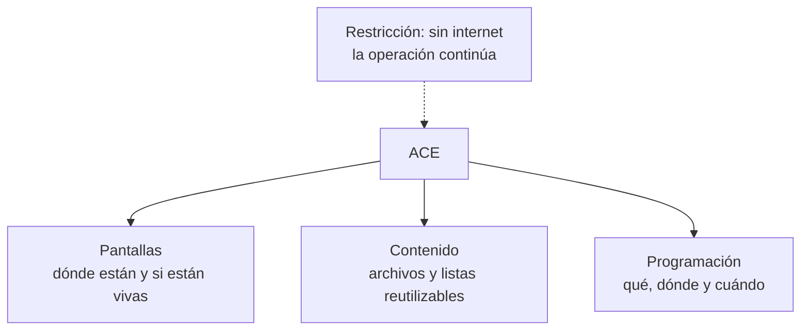

# Definición de producto ACE

## Qué pasó

Se redactó la definición de producto: qué es ACE, para quién, qué problema
resuelve, qué hace y cuál es su alcance inicial. Cabe en una página.

## Por qué

Las ocho cajas abiertas del diagrama se estaban evaluando sin un blanco
definido. Sin saber qué es el producto, no hay contra qué medir una decisión
técnica.

## Implicancias

- **ACE hace tres cosas:** pantallas, contenido y programación. Nada más.
- **La restricción que define el producto es la independencia de internet.**
  Si se cae la conexión, las pantallas siguen reproduciendo y el operador en
  sitio sigue pudiendo cambiar lo que se muestra. Eso condiciona la mayoría de
  las decisiones técnicas abiertas.
- **Se declaró lo que queda fuera:** producción de contenido, mantenimiento
  físico, clientes con más de un sitio y permisos por sector.
- El alcance inicial queda marcado como propuesta y requiere validación.

## Estado actual

Documento terminado, pendiente de revisión de Tomás. No cierra ninguna decisión
técnica.

## Enlaces

- [[Producto]]
- [[T-005 - Preparar propuesta de definición de producto ACE]]

## Apoyo visual

