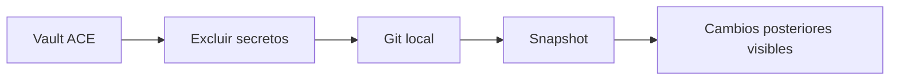

# Inicialización segura de Git local

## Qué pasó

Se inicializó un repositorio Git local en el vault ACE y se creó el primer snapshot.

## Por qué

Dos agentes y tres personas ya modifican el workspace. Se necesitaba historial y recuperación antes de construir los harnesses.

## Implicancias

- La rama inicial es `main`.
- Plugins instalados, estado de ventana y secretos locales no se versionan.
- La configuración compartible y el CSS del panel sí se versionan.
- No existe remoto.

## Estado actual

Primer commit: `714e1d8 chore: initialize local ACE workspace`.

Claude generó cambios nuevos después del snapshot; permanecen sin confirmar y demuestran que el historial ya está funcionando.

## Enlaces

- [[T-007 - Preparar versionado local seguro]]
- [[Operación y reportaje de ACE]]

## Apoyo visual

