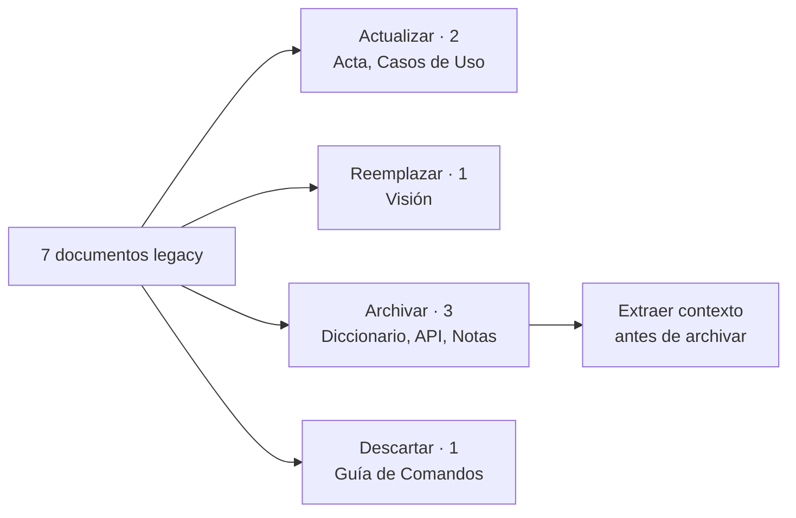

# Destino de la documentación legacy

## Qué pasó

Se propuso un destino para cada uno de los siete documentos heredados:
actualizar, reemplazar, archivar o descartar.

## Por qué

Después de clasificar el legacy contra el diagrama, quedó claro qué documentos
siguen aportando y cuáles ya fueron superados. Sin un destino definido, el
material se queda ocupando lugar y confundiendo al equipo.

## Implicancias

- **Dos documentos se actualizan:** el Acta de Constitución y la Matriz de
  Casos de Uso.
- **El Documento de Visión se reemplaza** por `Producto.md`.
- **Tres se archivan:** Diccionario de Datos, Especificación de la API y las
  notas de Tomás.
- **Uno se descarta:** la Guía de Comandos y Terminal.
- **Hay que extraer información antes de archivar las notas.** Contienen
  contexto de cliente que no está en ningún otro documento: Unreal Engine y
  Unity como software en uso, paneles LED, y tres preguntas para Cristóbal que
  alimentan las cajas de reproducción en pantalla e infraestructura.

## Estado actual

Propuesta lista, pendiente de aprobación de Tomás. **Nada se movió, borró ni
resubió a Drive.**

## Enlaces

- [[Destino del legacy]]
- [[Clasificación del legacy]]
- [[T-010 - Proponer destino de la documentación legacy]]

## Apoyo visual

