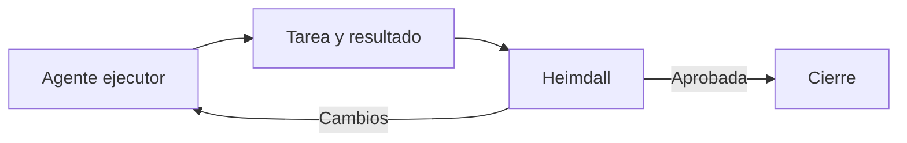

# Identidades y revisión cruzada

## Qué pasó

Se definieron identidades temporales para los agentes y la revisión cruzada dentro de cada tarea.

## Por qué

Los agentes necesitan responsables, territorios y trazabilidad equivalentes a los usuarios humanos.

## Implicancias

- Un agente no puede revisar su propio trabajo.
- Heimdall revisa e informa; el ejecutor corrige.
- La revisión queda visible en la tarea, no en un espacio separado.

## Estado actual

Propuesta implementada en el panel. Pendiente de revisión de Tomás.

## Enlaces

- [[Registro de agentes ACE]]
- [[Heimdall - Revisión independiente]]
- [[Sistema de reportaje ACE]]
- [[T-002 - Diseñar comunicación entre agentes y equipo]]

## Apoyo visual

