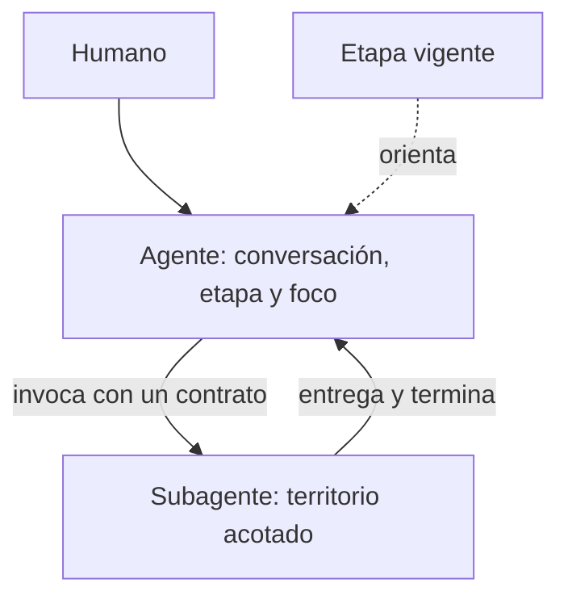

# Agentes, subagentes y etapas

## Reporte del ejecutor

### Resumen

ACE separó dos figuras antes mezcladas. Un **agente** mantiene una relación de trabajo con el usuario: conversa, recupera contexto y declara etapa y foco actuales. Un **subagente** se invoca con un contrato acotado, conserva territorio y termina al entregar.

La etapa expresa el tramo vigente y orienta sin dar permisos. El foco vive únicamente en el registro de agentes. Las etapas cerradas se conservan y la siguiente se abre cuando corresponde.

### Implicancias

- Los agentes no tienen territorio fijo; los subagentes sí.
- Trabajar fuera de la etapa es posible y se explica en la tarea.
- Cambiar de etapa no obliga a reescribir identidades.
- Heimdall es subagente porque se invoca para revisar y entregar un veredicto.
- La separación está documentada, pero aún falta un harness que cargue sus reglas.

### Detalle técnico y evidencia

- Cambio principal: `1811728 feat: separate agents from subagents with stage and focus`.
- Se crearon [[E-001 - Ecosistema]] y [[Registro de subagentes ACE]]; Heimdall fue trasladado.
- El territorio de agentes se eliminó de [[Mapa del ecosistema ACE]], [[Reglas de trabajo de Tomás]] y [[Registro de agentes ACE]]; el foco quedó con una sola fuente.
- [[T-016 - Separar agentes de subagentes]] conserva alcance y criterios.
- El cruce con el foco de Fenrir quedó registrado como caso de coordinación y alimentó [[T-012 - Cerrar comunicación v0 entre agentes]].

### Abierto

- [[T-013 - Crear harness compartido de agentes]] debe recuperar etapa, foco y reglas consistentemente.
- [[T-014 - Ejecutar piloto real de continuidad]] debe validar la separación en trabajo real.

## Revisión

Pendiente de Tomás. Debe confirmar que agente, subagente, etapa, foco y territorio se distinguen con claridad, y que lo implementado no se confunde con el harness y el piloto pendientes.

## Enlaces

- [[E-001 - Ecosistema]]
- [[Registro de agentes ACE]]
- [[Registro de subagentes ACE]]
- [[Mapa del ecosistema ACE]]
- [[Reglas de trabajo de Tomás]]
- [[T-012 - Cerrar comunicación v0 entre agentes]]
- [[T-013 - Crear harness compartido de agentes]]
- [[T-014 - Ejecutar piloto real de continuidad]]
- [[T-016 - Separar agentes de subagentes]]

## Apoyo visual

