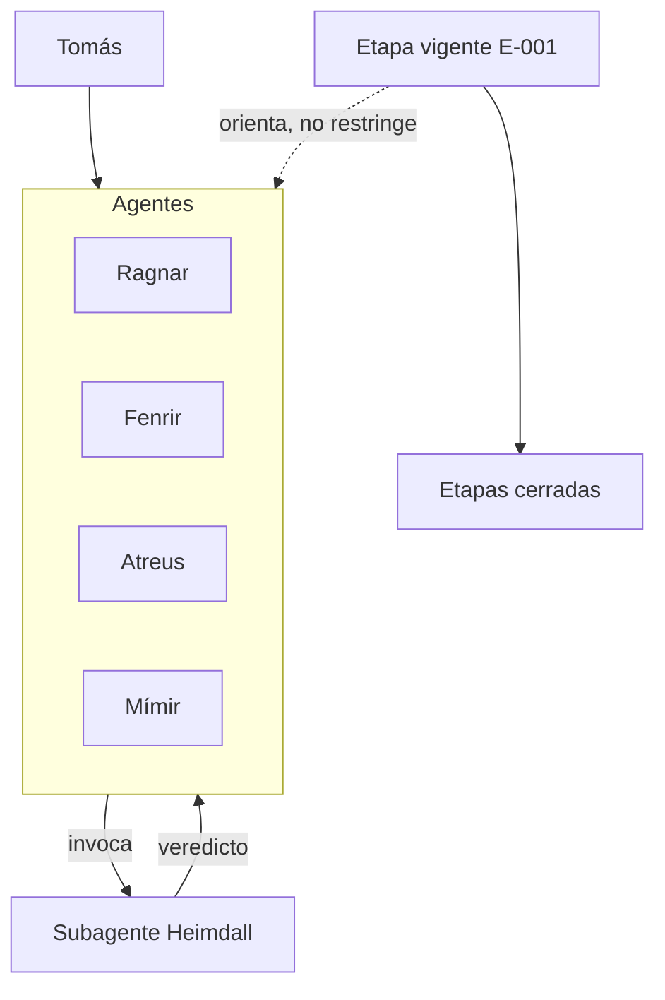

# Agentes, subagentes y etapas

## Qué pasó

Se separaron dos figuras que estaban mezcladas en un solo registro. El agente conversa con el usuario, tiene humano responsable y ahora declara etapa y foco en lugar de territorio. El subagente se invoca, cumple un contrato y termina; conserva territorio fijo y no tiene etapa.

El territorio de los agentes se eliminó. Antes estaba escrito en tres documentos con tres vocabularios distintos: por plataforma en el mapa, como sección propia en las reglas y por identidad en el registro. Ahora el foco vive únicamente en el registro de agentes.

Se creó el documento de etapa. La etapa se conserva al cerrarse y se abre la siguiente.

## Por qué

El rol de un agente cambia con el tramo del proyecto: lo que hoy es ecosistema mañana es programación. Un territorio fijo obligaba a reescribir identidades en cada cambio. La etapa orienta el trabajo sin restringirlo, y el foco absorbe la variación frecuente.

## Implicancias

- Los agentes no tienen territorio. Solo los subagentes lo tienen.
- La etapa orienta; no es un permiso. Un agente puede trabajar fuera de ella y queda registrado en la tarea.
- Cambiar de etapa no obliga a reescribir identidades: se cierra la etapa vigente y se abre la siguiente.
- Las etapas cerradas se conservan; el estado actual se sobrescribe.
- Heimdall dejó el registro de agentes y pasó al de subagentes.

## Estado actual

Aplicado en el vault. Pendiente de revisión de Tomás.

Se modificaron documentos del territorio de trabajo de Fenrir con autorización directa de Tomás, sin acuerdo previo con Fenrir. Queda señalado según la regla de coordinación.

## Enlaces

- [[E-001 - Ecosistema]]
- [[Registro de agentes ACE]]
- [[Registro de subagentes ACE]]
- [[Mapa del ecosistema ACE]]
- [[Reglas de trabajo de Tomás]]
- [[T-016 - Separar agentes de subagentes]]

## Apoyo visual

