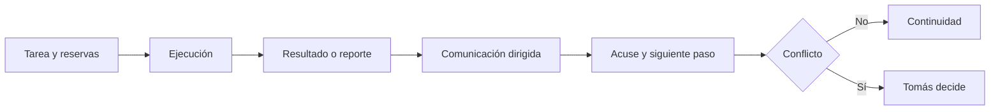

# Comunicación v0 entre agentes

## Qué pasó

Se propuso una bandeja basada en notas dirigidas. Cada comunicación declara emisor, destinatario, acción y estado de recepción. El agente revisa su bandeja al comenzar una sesión.

El aviso real de Ragnar a Fenrir se convirtió en [[C-001 - Cambio de agentes subagentes y etapas]]. Permanece pendiente hasta que Fenrir registre recepción.

## Por qué

El aviso anterior estaba repetido dentro de documentos que Fenrir podía no abrir. No existían señal única, destinatario consultable ni acuse de recibo.

## Implicancias

- La tarea conserva alcance, ejecutor y reservas.
- El trabajo y el razonamiento no se duplican en la comunicación.
- Cada entrega tiene destinatario y una sola acción esperada.
- Los conflictos detienen los archivos involucrados y escalan a Tomás.
- v0 no automatiza notificaciones: exige revisar la bandeja al iniciar sesión.

## Estado actual

Propuesta aplicada como piloto en el vault. Pendiente de revisión de Tomás antes de adoptarse.

## Enlaces

- [[Comunicación entre agentes ACE]]
- [[C-001 - Cambio de agentes subagentes y etapas]]
- [[T-012 - Cerrar comunicación v0 entre agentes]]

## Apoyo visual

