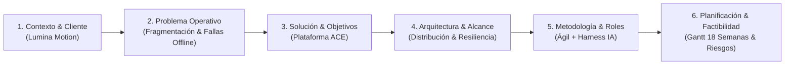

# Narrativa y diseño de diapositivas para la Presentación Fase 1

## Reporte del ejecutor (Matías / Atreus)

### Resumen

Se diseñó la **narrativa completa (storyline)** y la **estructura diapositiva por diapositiva** para la presentación grupal evaluada de la Fase 1 (Semana 4).

La presentación consta de **12 diapositivas técnicas y ejecutivas**, estructuradas para defender el proyecto en un tiempo óptimo de **12 a 15 minutos**, cumpliendo con los estándares de lenguaje técnico disciplinar y colaboración exigidos por los **Indicadores 11 y 13** de la pauta de Duoc UC (20 puntos individuales).

---

## 1. Storyline de la Exposición

---

## 2. Estructura Detallada Diapositiva por Diapositiva

### Diapositiva 1: Portada Oficial
- **Título principal:** ACE — Autonomous Content Engine
- **Subtítulo:** Plataforma Centralizada de Cartelería Digital con Resiliencia Offline
- **Datos académicos:**
  - Asignatura: Capstone (PTY4614) — Evaluación Sumativa Fase 1
  - Carrera: Ingeniería en Informática — Sede Antonio Varas
  - Docente: [Nombre del Profesor]
- **Integrantes:**
  - Tomás Escalante
  - Matías Salas
  - Paulo Loyola
- **Apoyo visual:** Logo formal del proyecto ACE y diseño sobrio y profesional.

---

### Diapositiva 2: Contexto y Cliente Real (Lumina Motion)
- **Idea fuerza:** Entendimiento profundo del negocio y del cliente.
- **Contenido:**
  - **Quién es el cliente:** Lumina Motion, estudio multimedia especializado en diseño de experiencias visuales e interactivas.
  - **Operación real:** Despliegue de pantallas y tótems digitales en centros comerciales, tiendas de retail y eventos corporativos de alta visibilidad.
  - **Entorno de operación:** Redes heterogéneas, espacios públicos de alta afluencia y exigencia de disponibilidad continua sin pantallas en negro.
- **Apoyo visual:** Iconografía representativa de retail, eventos y pantallas multimedia.

---

### Diapositiva 3: La Problemática Operativa
- **Idea fuerza:** La fragmentación actual genera sobrecostos y alto riesgo de fallas en vivo.
- **Contenido:**
  - **Gestión desacoplada:** El contenido se actualiza manualmente mediante memorias USB (pendrive) o mediante múltiples herramientas propietarias de pago dispersas (MadMapper, Arena.im).
  - **Vulnerabilidad ante desconexión:** Si la red del centro comercial o evento falla, las pantallas pierden sincronización o quedan fuera de servicio.
  - **Costo de soporte elevado:** Cualquier cambio de programación de último minuto obliga a trasladar técnicos físicamente a cada sitio, aumentando los tiempos de respuesta y exponiendo la marca del cliente a errores públicos.
- **Apoyo visual:** Diagrama comparativo "Antes (Caos operativo manual) vs. Necesidad de Centralización".

---

### Diapositiva 4: La Solución Propuesta — ACE
- **Idea fuerza:** Un punto único de control que combina administración central con autonomía local.
- **Contenido:**
  - **¿Qué es ACE?:** Plataforma web de gestión de cartelería digital integral.
  - **Pilares de la solución:**
    1. *Centralización:* Control total de pantallas, sitios, sectores y contenidos multimedia desde un panel administrativo web.
    2. *Programación inteligente:* Calendarización horaria avanzada por fechas, bloques horarios y prioridades.
    3. *Resiliencia offline:* Reproducción continua garantizada incluso si se interrumpe la conexión a internet.
    4. *Telemetría y monitoreo:* Reporte continuo del estado de salud de cada pantalla en tiempo real.
- **Apoyo visual:** Diagrama de los 4 pilares con iconos conceptuales.

---

### Diapositiva 5: Objetivos del Proyecto
- **Idea fuerza:** Objetivos medibles, alcanzables y alineados a la ingeniería de software.
- **Contenido:**
  - **Objetivo General:** Desarrollar una plataforma centralizada de gestión de cartelería digital para Lumina Motion, que administre pantallas, contenido y programación horaria, garantizando la continuidad operativa ante pérdidas de conectividad.
  - **Objetivos Específicos:**
    1. *Modelado:* Diseñar la estructura de datos relacional y de almacenamiento local para sitios, sectores, medios y programación.
    2. *Administración:* Construir una interfaz web responsiva para la administración de pantallas y subida de medios.
    3. *Comunicación:* Implementar servicios de comunicación bidireccional cliente-servidor y telemetría en tiempo real.
    4. *Resiliencia:* Habilitar el módulo de reproducción autónoma en sitio con almacenamiento en caché local.
    5. *Validación:* Desplegar y validar el sistema en un entorno de pruebas con hardware real y el cliente.

---

### Diapositiva 6: Arquitectura del Sistema
- **Idea fuerza:** Arquitectura cliente-servidor distribuida, modular y tolerante a fallos.
- **Contenido:**
  - **Capa Servidor (Cloud / Central):**
    - Panel Web Frontend (React / Vue)
    - Backend API RESTful (FastAPI / Node.js)
    - Base de Datos Centralizada (PostgreSQL / Relacional)
    - Almacenamiento de archivos multimedia
  - **Capa Cliente (Player de Pantalla):**
    - Motor de reproducción multimedia (Web Engine / HTML5 Canvas)
    - Base de datos / Almacenamiento local (SQLite / IndexedDB)
    - Servicio de sincronización asíncrona y telemetría (Heartbeat)
- **Apoyo visual:** Diagrama de arquitectura técnica con separación clara de la nube y el nodo de pantalla.

---

### Diapositiva 7: Alcance del Producto y Requerimientos Clave
- **Idea fuerza:** Alcance acotado y definido para un MVP de alto impacto.
- **Contenido:**
  - **Módulos incluidos en el MVP:**
    - Autenticación y gestión de usuarios con roles.
    - Registro y agrupamiento jerárquico de pantallas (Sitio $\rightarrow$ Sector $\rightarrow$ Pantalla).
    - Biblioteca multimedia (videos, imágenes, secuencias).
    - Programador horario (playlists con reglas temporales).
    - Reproductor autónomo con soporte offline.
  - **Fuera de alcance inicial:** Integración con sistemas de cobro/facturación externa o renderizado interactivo en tiempo real 3D.
- **Apoyo visual:** Tabla o matriz de alcance "Dentro del Alcance vs. Futuras Fases".

---

### Diapositiva 8: Metodología de Trabajo y Roles del Equipo
- **Idea fuerza:** Trabajo colaborativo eficiente con ingeniería moderna y apoyo de IA.
- **Contenido:**
  - **Metodología:** Marco ágil adaptado (Scrum/Kanban) en sprints quincenales, complementado con un *harness operativo colaborativo asistido por IA (ACE)* versionado en Git.
  - **Distribución de Roles y Especialidades:**
    - **Tomás Escalante:** Arquitectura de Software, Desarrollo Backend y APIs de Comunicación.
    - **Matías Salas:** Gestión del Proyecto, Desarrollo de Software, Player y Vinculación con Lumina Motion.
    - **Paulo Loyola:** Desarrollo Frontend, Modelamiento de Bases de Datos y Aseguramiento Documental.
- **Apoyo visual:** Tarjetas de roles con fotos/avatares y responsabilidades técnicas.

---

### Diapositiva 9: Plan de Trabajo y Carta Gantt (18 Semanas)
- **Idea fuerza:** Planificación rigurosa con hitos claros hacia el título.
- **Contenido:**
  - **Fase 1 (S1 - S4):** Definición, requerimientos y fundamentación $\rightarrow$ **[Hito 1: Presentación Fase 1]**
  - **Fase 2 (S5 - S6):** Diseño de arquitectura, modelado de datos y wireframes UI/UX.
  - **Fase 3 (S7 - S11):** Desarrollo Core (API, Frontend Admin, Player Base) $\rightarrow$ **[Hito 2: Entrega de Avance S10]**
  - **Fase 4 (S12 - S14):** Funcionalidades avanzadas, scheduler y resiliencia offline.
  - **Fase 5 (S15 - S16):** Despliegue en Staging, pruebas con hardware real $\rightarrow$ **[Hito 3: Entrega Final S15]**
  - **Fase 6 (S17 - S18):** Validación de aceptación con cliente y defensa $\rightarrow$ **[Hito 4: Examen Final S17-18]**
- **Apoyo visual:** Gráfica de Carta Gantt simplificada y destacando los 4 hitos.

---

### Diapositiva 10: Factibilidad y Gestión de Riesgos
- **Idea fuerza:** Proyecto 100% viable con mitigaciones planificadas.
- **Contenido:**
  - **Factibilidad:**
    - *Técnica:* Tecnologías maduras y validadas por el equipo.
    - *Operativa:* Acceso directo y validación continua con Lumina Motion.
    - *Recursos:* Infraestructura cloud y hardware de prueba disponible.
  - **Matriz de Riesgos y Mitigación:**
    - *Riesgo:* Variabilidad en hardware de pantallas $\rightarrow$ *Mitigación:* Player desacoplado sobre estándares web.
    - *Riesgo:* Caídas de internet prolongadas $\rightarrow$ *Mitigación:* Caché local autónoma y sincronización asíncrona.
    - *Riesgo:* Desviación de plazos $\rightarrow$ *Mitigación:* MVP funcional garantizado en Semana 10.
- **Apoyo visual:** Matriz visual de Factibilidad y Mitigación.

---

### Diapositiva 11: Conclusiones e Impacto Esperado
- **Idea fuerza:** Cierre sólido del valor que entrega el proyecto.
- **Contenido:**
  - **Para Lumina Motion:** Reducción drástica de costos de soporte técnico en terreno, eliminación de pagos de licencias fragmentadas y confiabilidad total de transmisión frente a sus clientes.
  - **Para el Equipo:** Integración práctica de las competencias del perfil de egreso en un proyecto real de alta exigencia técnica.
  - **Siguiente paso inmediato:** Inicio del modelado de base de datos y diseño UI/UX en la Semana 5.

---

### Diapositiva 12: Cierre y Preguntas
- **Contenido:**
  - "Muchas gracias por su atención."
  - Espacio abierto para consultas, observaciones y retroalimentación de la comisión docente.
  - Datos de contacto y repositorio del equipo.

---

## Enlaces

- [[T-022 - Diseñar narrativa y diapositivas]]
- [[T-020 - Construir plan de trabajo y Carta Gantt]]
- [[R-016 - Plan de trabajo y Carta Gantt]]
- [[Borrador Fase 1]]
