# Guión de presentación, reparto de exposición y banco de preguntas de defensa

## Reporte del ejecutor (Matías / Atreus)

### Resumen

Se construyó el **guión estructurado de exposición**, el **reparto equitativo de tiempos y secciones** entre Tomás, Matías y Paulo, y el **banco de preguntas y respuestas críticas de defensa** para la presentación grupal evaluada de la Fase 1.

Este diseño asegura el cumplimiento de los **Indicadores 11 y 13** de la pauta de Duoc UC (Lenguaje técnico disciplinar y Trabajo en equipo/Colaboración — 20 puntos individuales).

---

## 1. Reparto de Exposición y Cronometría (Tiempo Total: 12 - 15 min)

```mermaid
gantt
    title Reparto de Tiempos de Exposición Fase 1
    dateFormat mm
    axisFormat %M min
    section Bloque 1 (Matías)
    Problema & Solución ACE : 00, 04m
    section Bloque 2 (Tomás)
    Arquitectura & Alcance : 04, 09m
    section Bloque 3 (Paulo)
    Metodología & Gantt : 09, 14m
    section Cierre (Equipo)
    Preguntas Comisión : 14, 20m
```

---

## 2. Guión Detallado por Orador

### Bloque 1: Apertura, Contexto y Problemática (Minutos 0:00 - 4:30)
**Orador principal:** **Matías Salas**

#### Diapositiva 1: Portada
> *"Buenos días profesor y compañeros. Hoy les presentamos el proyecto de título de nuestro equipo: **ACE (Autonomous Content Engine)**, una plataforma centralizada de gestión de cartelería digital con alta resiliencia offline, desarrollada para la productora multimedia Lumina Motion. El equipo está compuesto por Tomás Escalante, Paulo Loyola y quien les habla, Matías Salas."*

#### Diapositiva 2: Contexto y Cliente Real (Lumina Motion)
> *"Lumina Motion es un estudio dedicado a la producción de experiencias inmersivas y visuales, operando pantallas y tótems digitales en centros comerciales, tiendas de retail y eventos corporativos de alta afluencia. Su negocio exige que las pantallas operen de forma ininterrumpida y con contenidos actualizados de manera dinámica."*

#### Diapositiva 3: La Problemática Operativa
> *"Actualmente, la operación de estas pantallas está fragmentada: gran parte del contenido debe actualizarse manualmente en terreno mediante memorias USB (pendrives), mientras que otra parte utiliza software propietario de pago sin integración central. Esto genera dos problemas graves: altos costos operativos por traslados técnicos y un riesgo crítico de fallas o pantallas en negro cuando la conexión a internet en los locales se interrumpe."*

#### Diapositiva 4: La Solución — ACE
> *"Para resolver esta necesidad nace ACE: un sistema centralizado que permite a Lumina Motion administrar todos sus sitios, pantallas y programaciones desde una única interfaz web, garantizando además que cada pantalla siga reproduciendo su programación de forma autónoma gracias a su almacenamiento local, incluso frente a caídas prolongadas de internet. Doy paso a Tomás para explicar los aspectos técnicos y arquitectónicos."*

---

### Bloque 2: Objetivos, Arquitectura y Alcance (Minutos 4:30 - 9:00)
**Orador principal:** **Tomás Escalante**

#### Diapositiva 5: Objetivos del Proyecto
> *"Gracias Matías. Nuestro **Objetivo General** es desarrollar una plataforma centralizada de cartelería digital para Lumina Motion que administre pantallas, contenidos y programación horaria, garantizando continuidad ante fallas de red. Para lograrlo, definimos 5 objetivos específicos: modelar la estructura relacional y local de datos, construir la interfaz de administración web, implementar las APIs de comunicación y telemetría, habilitar la resiliencia offline en el reproductor de pantalla, y desplegar el sistema en un entorno de pruebas con hardware real."*

#### Diapositiva 6: Arquitectura Distribuida del Sistema
> *"La arquitectura de ACE se basa en un modelo cliente-servidor distribuido y desacoplado en dos capas principales:*
> 1. *Capa Central / Servidor:* Compuesta por una aplicación web frontend reactiva, servicios backend API RESTful y una base de datos relacional centralizada que gestiona la lógica de negocio y los archivos multimedia.
> 2. *Capa Cliente / Player:* Instalada en cada pantalla (microcomputador o Mini PC), dotada de un motor de reproducción web liviano, un almacenamiento en caché local (SQLite/IndexedDB) y un servicio de sincronización asíncrona que reporta telemetría y descarga actualizaciones cuando hay red disponible."*

#### Diapositiva 7: Alcance del MVP y Requerimientos
> *"El alcance para este semestre incluye: autenticación con roles, jerarquía de sitios y pantallas, biblioteca de medios, motor de programación horaria por bloques y el Player con reproducción autónoma. Quedan fuera del alcance inicial integraciones de pasarelas de pago o render 3D complejo. Le cedo la palabra a Paulo para detallar la metodología y planificación."*

---

### Bloque 3: Metodología, Planificación y Cierre (Minutos 9:00 - 13:30)
**Orador principal:** **Paulo Loyola**

#### Diapositiva 8: Metodología y Organización del Equipo
> *"Gracias Tomás. Para asegurar la calidad y trazabilidad del proyecto, adoptamos una metodología ágil iterativa e incremental (Scrum/Kanban) con sprints quincenales, potenciada por un harness colaborativo asistido por IA (ACE) versionado en Git. Nos distribuimos en roles claros: Tomás en Arquitectura y Backend, Matías en Gestión del Proyecto, Player y Vinculación con el Cliente, y yo en Desarrollo Frontend, Modelado de Datos y Aseguramiento Documental."*

#### Diapositiva 9: Plan de Trabajo y Carta Gantt (18 Semanas)
> *"El plan de trabajo estructura las 18 semanas en 6 fases orientadas a los 4 hitos de evaluación de Duoc UC:*
> - *Fase 1 (S1-S4): Fundamentación y Presentación actual.*
> - *Fase 2 (S5-S6): Diseño de arquitectura, modelado de datos relacional y wireframes UI/UX.*
> - *Fase 3 (S7-S11): Desarrollo Core (API, panel web y Player) hacia el **Hito de Avance de la Semana 10**.*
> - *Fase 4 (S12-S14): Programación horaria avanzada y resiliencia offline.*
> - *Fase 5 (S15-S16): Despliegue en Staging y **Entrega Final de la Semana 15**.*
> - *Fase 6 (S17-S18): Validación con Lumina Motion y Defensa de Examen Final."*

#### Diapositiva 10: Factibilidad y Mitigación de Riesgos
> *"El proyecto es 100% factible: contamos con acceso directo al cliente, tecnologías web maduras y mitigación de riesgos planificada: la heterogeneidad de pantallas se resuelve con estándares web desacoplados, y los cortes de red se mitigan mediante la reproducción local autónoma."*

#### Diapositiva 11 y 12: Conclusiones y Cierre
> *"En conclusión, ACE entregará a Lumina Motion una solución robusta que elimina costos de soporte presencial y asegura confiabilidad operativa, permitiéndonos integrar de forma práctica las competencias de nuestra carrera. Quedamos a disposición de la comisión para responder sus preguntas. Muchas gracias."*

---

## 3. Banco de Preguntas Críticas y Respuestas de Defensa

| # | Pregunta previsible del docente / comisión | Quién responde | Respuesta técnica estructurada |
|---|---|---|---|
| **1** | **"¿Cómo garantizan técnicamente que la pantalla no se quede en negro si se corta internet?"** | Tomás / Matías | *"El Player no realiza streaming directo. Cada vez que hay una nueva programación y conexión activa, descarga y almacena los archivos y la metadata en una base de datos local (SQLite o IndexedDB). Si la red se cae, el reproductor sigue leyendo su almacenamiento local en un bucle infinito según las reglas horarias ya cacheadas."* |
| **2** | **"¿Por qué el cliente no compra una solución ya existente en el mercado?"** | Matías | *"Lumina Motion ya utiliza softwares comerciales como MadMapper y Arena, pero están pensados para mapeo y proyección de eventos, no para cartelería masiva distribuida. Las soluciones comerciales de cartelería cobran suscripciones mensuales por cada pantalla instalada y no permiten una personalización offline adaptada a los eventos itinerantes del cliente."* |
| **3** | **"¿Cómo manejan la diferencia de hardware y resoluciones en las pantallas instaladas?"** | Paulo / Tomás | *"El Player de pantalla está construido sobre un contenedor web responsivo y liviano (HTML5/Canvas), lo que permite escalar y adaptar la resolución automáticamente (Full HD, 4K o pantallas verticales) consumiendo un mínimo de CPU y memoria."* |
| **4** | **"¿18 semanas es tiempo suficiente para que 3 personas entreguen este sistema?"** | Matías | *"Sí, porque acotamos el alcance mediante sprints quincenales y priorizamos tener un MVP completamente operativo en la Semana 10 (Hito 2). Las semanas posteriores se dedican exclusivamente a robustecer la tolerancia a fallos offline y realizar pruebas de aceptación con Lumina Motion."* |
| **5** | **"¿Cómo sabe el administrador si una pantalla está funcionando si no hay internet?"** | Tomás / Paulo | *"Cada Player emite un paquete liviano de telemetría (Heartbeat) periódico. En el panel administrativo, si una pantalla deja de emitir heartbeat por más de cierto umbral de tiempo, el sistema la marca en estado 'Offline / Reproduciendo en caché', registrando la última hora de contacto."* |

---

## Enlaces

- [[T-023 - Preparar defensa y ensayar la presentación]]
- [[T-022 - Diseñar narrativa y diapositivas]]
- [[R-017 - Narrativa y diseño de diapositivas de la presentación]]
- [[R-016 - Plan de trabajo y Carta Gantt]]

## Revisión y cierre

**Aprobada por el equipo — 2026-09-05.** Tomás confirmó el cierre de la preparación de defensa tras la entrega de la primera evaluación. Este cierre registra la presentación realizada sin reconstruir retrospectivamente el detalle del ensayo; la nota y la retroalimentación de Duoc se registrarán cuando estén disponibles.
