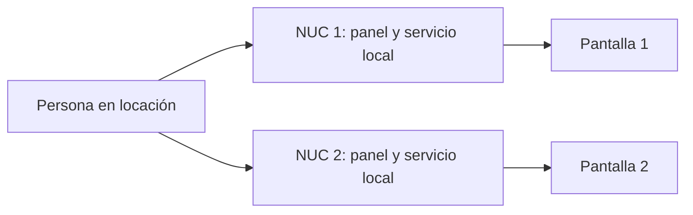
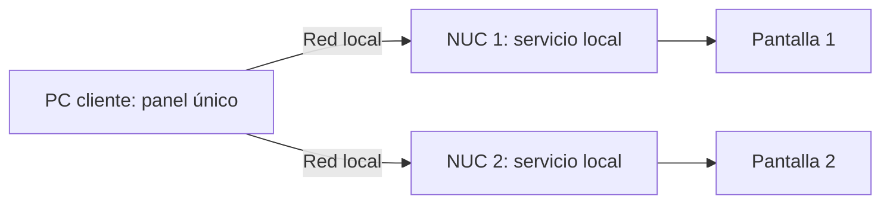

# Gestión local sin internet

**Pendiente de conversar con Cristóbal y el equipo.**

## Contexto y pregunta

ACE apunta a locaciones fijas, generalmente con un NUC por pantalla. La gestión habitual será centralizada y remota; se plantea respaldo local para cambiar contenido y programación sin internet. Falta conocer presencia de personal, frecuencia y urgencia de esos cambios.

**¿Basta con administrar cada NUC individualmente durante un corte, o se necesita un panel local conjunto para gestionar varias pantallas?**

## A. Panel individual por NUC

- Respaldo acotado, sin coordinación entre NUC.
- Los cambios se repiten en cada equipo.
- Si los paneles son accesibles por red local, pueden abrirse desde un mismo computador; no exige recorrer físicamente las pantallas.

## B. PC cliente con panel conjunto

- Centraliza la gestión local; cada NUC sigue ejecutando su propia programación.
- No agrega un servidor dedicado: el PC es cliente y solo se necesita para gestionar.
- Requiere panel disponible sin internet, acceso autorizado a los NUC y confirmación de cambios por pantalla.
- Agrega complejidad que debe justificarse por el uso real.

## Acuerdo base - 2026-09-04

ACE compromete la capacidad de cambiar contenido y programación desde la locación sin internet, usando archivos disponibles allí. No se ha elegido todavía entre A y B; ambas alternativas se conservan para validación con Cristóbal y el equipo.

## A confirmar

- ¿Quién puede intervenir en la locación y con qué equipo/red?
- ¿Cuántas pantallas deben cambiarse durante cortes, con qué frecuencia y qué impacto tiene esperar?
- Ambas opciones requieren contenido disponible localmente y definir cómo conciliar los cambios al volver internet.
