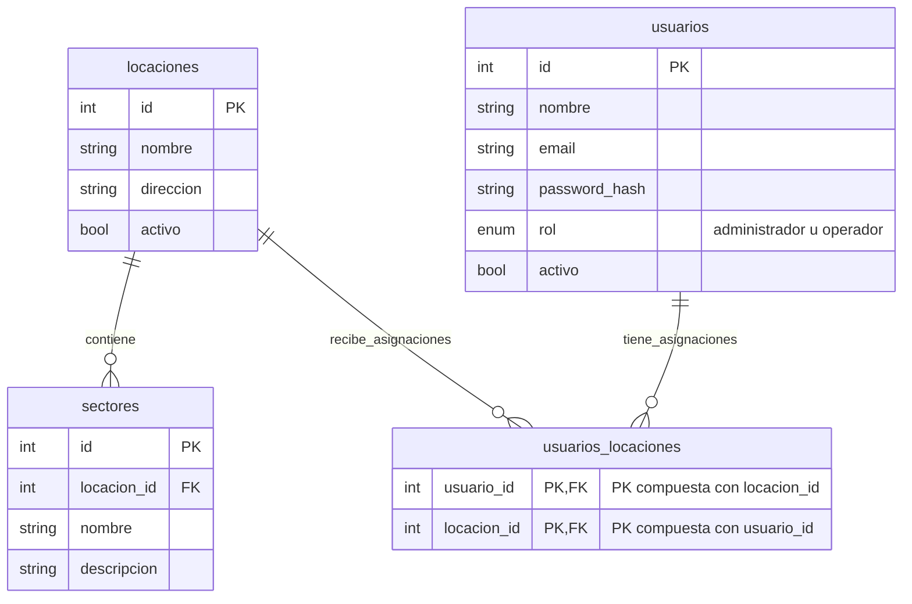

# Operadores, clientes y locaciones

**Base inicial acordada con Tomás; validación pendiente con Cristóbal y el equipo.**

## Contexto y pregunta

Según el entendimiento actual, habría un operador por locación y posiblemente un cliente por locación. Falta confirmar esa realidad con Cristóbal; estas relaciones podrían cambiar en el futuro y no deben tratarse todavía como restricciones del modelo.

**¿Qué relaciones entre operadores, clientes y locaciones debe soportar ACE desde el inicio, y cuáles pueden quedar para después? ¿Necesitamos modelar al cliente o basta inicialmente con locaciones y accesos asignados?**

## Casos a confirmar

- Un operador gestiona varias locaciones, o varios operadores comparten una locación.
- Un cliente tiene varias locaciones, o una locación atiende a varios clientes.
- Qué contenido y playlists pueden compartirse y quién puede verlos, modificarlos y utilizarlos.
- Cuáles de estos casos existen hoy, cuáles son próximos y cuáles son solo posibilidades.

## Alternativas e implicancias

**A. Locaciones y permisos, sin entidad cliente inicialmente**
- Menos estructura inicial; usuarios y contenido se vinculan a las locaciones autorizadas.
- No representa por separado la pertenencia del contenido a un cliente; incorporarla después podría exigir migración.

**B. Cliente explícito, además de locaciones y permisos**
- Permite representar pertenencia y agrupación por cliente.
- Agrega relaciones y reglas que deben justificarse con casos reales; no implica construir suscripciones ni un SaaS completo.

En ambas alternativas, pertenecer al mismo cliente no concede acceso automático a todas sus locaciones o contenidos. El administrador global puede acceder al conjunto; los operadores, únicamente a lo autorizado.

## Respuesta de trabajo — Tomás, 2026-09-03

Adoptamos **A: sin entidad cliente por ahora**. Según el entendimiento actual, casi todos los casos serían una locación con un operador; falta confirmarlo con Cristóbal. El primer uso será solo por Cristóbal como administrador. Diseñamos desde ahora operadores con acceso a una o varias locaciones, sin exigir cuentas de operador al comenzar ni limitar cada locación a un usuario.

Agregar clientes y más personalización no se considera necesario para este alcance. La pregunta permanece abierta para contrastar esa base con el cliente y el equipo.

### Tablas relacionadas

- `locaciones` reemplaza a `sitios`; `sectores.locacion_id` reemplaza a `sitio_id`. Las pantallas siguen perteneciendo a un sector mediante `pantallas.sector_id`.
- Se elimina `usuarios.sitio_id`: las asignaciones viven en `usuarios_locaciones`.
- El administrador tiene acceso global por rol. Un operador accede solo a sus asignaciones; sin asignaciones no tiene acceso.
- **Contenido y playlists:** deben segmentarse por locación/es; la relación exacta y los permisos de compartición siguen pendientes. No se asume una biblioteca global para operadores.

Este diagrama registra la respuesta a esta fecha; el modelo vigente continúa en [[Modelo de datos]].
